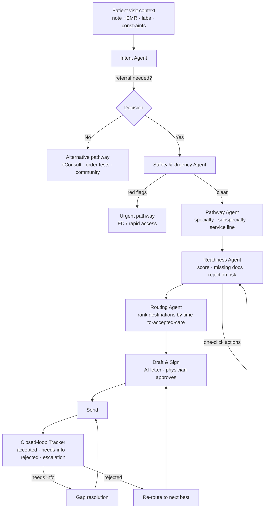

# Referral GPS — Architecture

> **The intelligence layer that runs _before_ referral intake.**
> Referral GPS helps primary-care doctors send the right patient to the right
> specialist, with the right documents, through the **fastest realistic
> pathway** — then tracks the referral closed-loop until the patient is seen.

This document describes the architecture of the frontend demo: a dynamic,
single-page React application driven entirely by dummy data and a **simulated AI
layer** (no backend, no API key required).

---

## 1. Problem & product thesis

Referrals are healthcare's last broken handoff:

| Figure | Meaning | Source |
| --- | --- | --- |
| **25–40%** of referrals never complete; **~38%** never close the loop | Most stall between the referring office and the specialist scheduler | MedCity News, 2025 |
| PCPs send referral notes **69%** of the time; specialists receive only **34%** | The communication gap is the failure point | Referral communication studies |
| **25–50%** of physicians never learn if the patient was seen | No closed-loop confirmation exists today | Patient-leakage research |
| **$150B/yr** US cost of broken referrals | Lost revenue, rework, avoidable harm | HealthLeaders, 2025 |
| Ontario median wait **11.3 wks** vs eConsult **~3.7 days** | eConsult prevented unnecessary in-person visits **64%** of the time | Ottawa Hospital / CJS |

**The thesis the product sells:** existing tools (e.g. Phelix) already automate
fax/referral admin, EMR routing, and chasing missing info. Referral GPS is
different — it makes the *decision* **before the referral enters the queue**:

> Optimise for **time-to-accepted-care** — wait time adjusted by rejection risk,
> missing documents, patient feasibility and clinical fit — **not** the shortest
> advertised wait, and not merely "is the referral complete?"

---

## 2. The agent pipeline

The wizard models a chain of cooperating "agents". Each is a discrete, reviewable
step; the physician stays in control and nothing is sent automatically.



Each step maps to a component under
[`src/features/referral-wizard/steps/`](src/features/referral-wizard/steps/).

---

## 3. Tech stack & rationale

| Concern | Choice | Why |
| --- | --- | --- |
| Build / dev | **Vite + React 18 + TypeScript** | Instant `npm run dev`, type safety for the domain model |
| Styling | **TailwindCSS** + CSS variables | Fast, consistent "soft calm / pastel" theme |
| Animation | **framer-motion** | Step transitions, streaming, animated scores |
| State | **zustand** | One small, ergonomic store for wizard + closed-loop |
| Charts | **recharts** | Impact-dashboard visualisations |
| Routing | **react-router-dom** | Role-gated module navigation |
| Icons | **lucide-react** | Clean, consistent iconography |

The "AI" is intentionally **simulated** ([`src/lib/aiSimulator.ts`](src/lib/aiSimulator.ts)):
scripted outputs, fake latency and a token-streaming animation. This keeps the
demo bulletproof and offline. The async signatures are drop-in replaceable with
real Claude calls later (see §10).

---

## 4. Directory structure

```
src/
├── main.tsx                  # React root + router
├── App.tsx                   # Layout shell: Sidebar + TopBar + <Outlet/>
├── index.css                 # Tailwind layers + pastel theme tokens
├── types/index.ts            # The whole domain model
├── data/                     # DUMMY DATA
│   ├── patients.ts           #   5 rich scenarios that drive the demo
│   ├── providers.ts          #   specialist directory (scoring inputs)
│   ├── documents.ts          #   clinical-document catalog
│   ├── pathways.ts           #   specialty / subspecialty / service line
│   ├── referrals.ts          #   pre-seeded sent referrals for the tracker
│   └── stats.ts              #   impact metrics (real research figures)
├── lib/
│   ├── aiSimulator.ts        # latency + token streaming + agent sequence hooks
│   ├── scoring.ts            # Referral Match Score (transparent factors)
│   ├── readiness.ts          # readiness score + "why it might fail"
│   └── format.ts             # weeks / dates / tone helpers
├── store/useReferralStore.ts # zustand: role, wizard, present docs, referrals
├── components/
│   ├── ui.tsx                # Card, Button, Badge, ScoreBar, ProgressRing, …
│   ├── ai.tsx                # StreamingText, AIThinking, ResponsibleAIBanner
│   └── layout.tsx            # Sidebar, TopBar, role switcher
├── features/referral-wizard/
│   ├── ReferralWizard.tsx    # orchestrates the 7 steps
│   ├── WizardStepper.tsx     # animated progress header
│   ├── parts.tsx             # StepHeading / StepNav / PatientContextCard
│   └── steps/Step1..Step7    # one component per agent step
└── pages/
    ├── DashboardPage.tsx     # impact dashboard (landing)
    ├── WorkbenchPage.tsx     # patient queue → launches the wizard
    ├── TrackerPage.tsx       # closed-loop status board
    ├── AdminPage.tsx         # gap-resolution + escalation queue
    └── PatientPage.tsx       # patient-facing status & prep
```

---

## 5. Data model

All types live in [`src/types/index.ts`](src/types/index.ts). The key entities:

- **`Patient`** — context + a precomputed "model output" (`intent`, `redFlags`,
  `recommendedPathwayId`, `requiredDocIds`, `candidateProviderIds`, optional
  `alternative`). Swapping the active patient changes the *entire* downstream flow.
- **`Provider`** — a clinic with the raw fields the scorer reasons about
  (`clinicalFit`, `acceptanceProbability`, `rawWaitWeeks`, `modality`,
  `distanceKm`, `requiredDocIds`, `availabilityVerifiedDaysAgo`, …).
- **`ClinicalDocument`** — a weighted, actionable requirement (order/ask/attach).
- **`RankedProvider`** — the scorer's output: total score **plus per-factor
  contributions** so the UI can always show the "why".
- **`Referral`** — the closed-loop record: `status`, `gapTasks[]`, `audit[]`,
  `rejectionReason`, `nextBestProviderId`, `patientPrep[]`.

---

## 6. State management

A single zustand store ([`src/store/useReferralStore.ts`](src/store/useReferralStore.ts)):

```
role                 physician | admin | patient   (role switcher)
streaming            master toggle for the AI streaming animation
── active wizard ──
activePatientId      which chart the wizard is evaluating
step                 intent | safety | pathway | readiness | routing | draft | sent
pathwayId            chosen subspecialty pathway
presentDocIds        docs currently satisfied (drives LIVE readiness)
selectedProviderId   chosen destination
── closed loop ──
referrals            seeded + newly-sent referrals
```

Readiness and match scores are **derived on the fly** from `presentDocIds` via
`computeReadiness()` and `rankProviders()` — so clicking "Order Holter"
immediately recomputes the readiness ring and re-ranks destinations.

---

## 7. Scoring algorithm

[`src/lib/scoring.ts`](src/lib/scoring.ts) computes the **Referral Match Score**:

```
Match = 0.30·clinicalFit
      + 0.25·acceptanceProbability
      + 0.20·timeToAcceptedCare    ← the differentiator
      + 0.10·patientFeasibility
      + 0.10·referralReadiness
      + 0.05·continuity/preference
```

`timeToAcceptedCare` is **not** the advertised wait. It inflates the raw triage
wait by an acceptance-risk multiplier (low acceptance ⇒ more bounce-backs) and a
readiness penalty (incomplete packages get parked before triage):

```
ttac = rawWaitWeeks · acceptanceRisk + readinessPenaltyWeeks
```

Every factor is returned with its `raw`, `weight`, `contribution` and a
human-readable `reason`, so the routing UI renders a transparent breakdown —
**never a black-box number**.

---

## 8. Theming

"Soft calm / pastel": mint (primary) + lavender (secondary) on warm off-white
surfaces, generous rounding and soft shadows. Tokens are defined in
[`tailwind.config.ts`](tailwind.config.ts) and surfaced as CSS variables in
[`src/index.css`](src/index.css). Contrast targets WCAG AA so it still reads as
trustworthy clinical software.

---

## 9. Responsible-AI checkpoints

These are visible throughout the UI, not buried in a policy doc:

- **`ResponsibleAIBanner`** — "Physician review required. Referral GPS recommends
  pathways — it does not diagnose and never sends automatically."
- **Confidence scores** on intent detection.
- **Reasons** for every recommendation (the `✓` lists).
- **Source provenance** chips (which document a claim came from).
- **Availability timestamps** ("last verified N days ago").
- **Full audit trail** on every referral in the tracker.
- A red-flag **safety gate** that forces an urgent-pathway review.

---

## 10. Running it & future work

```bash
npm install
npm run dev      # http://localhost:5173
npm run build    # typecheck (tsc -b) + production build
npm run preview  # serve the production build
```

**Roles:** use the switcher in the top bar (Family Physician / Clinic Admin /
Patient) to see each persona's view. **AI streaming** can be toggled from the
sidebar.

**Future work**
- Replace [`aiSimulator.ts`](src/lib/aiSimulator.ts) with real **Claude** calls
  (`claude-opus-4-8` for drafting, `claude-sonnet-4-6` for triage classification)
  behind the same async signatures.
- Ingest real clinical data via **HL7 FHIR** (the standard for healthcare
  information exchange) and connect to EMR / fax inboxes.
- Learn provider acceptance / wait-time models from outcome data captured by the
  closed-loop tracker.
